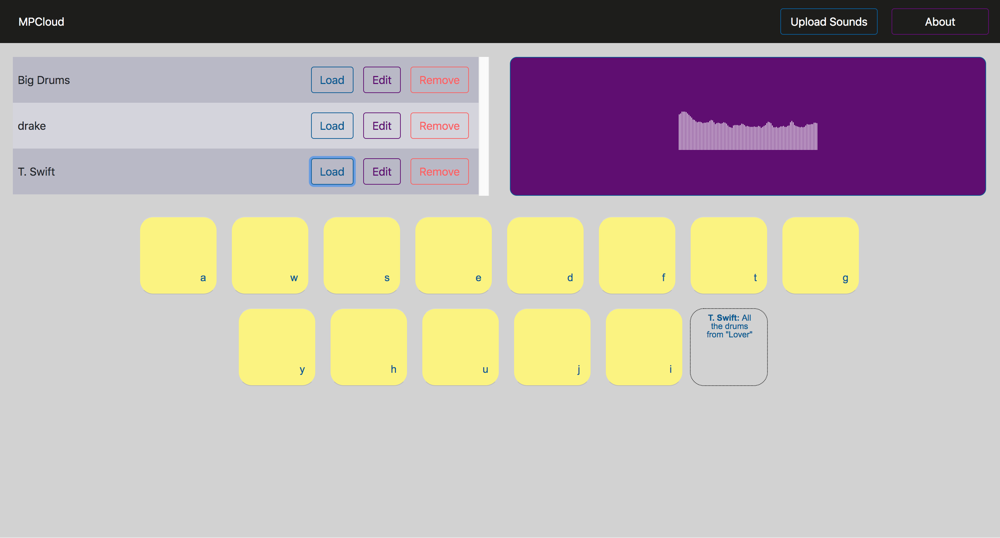
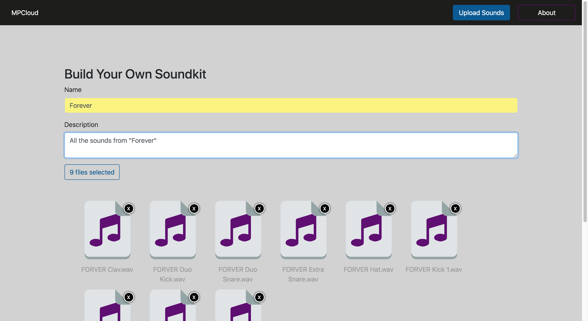

## mpCLOUD
An in-browser music production and performance application that allows users to upload and edit their own sound-sets.

## Motivation
For songwriters, producers and beat-makers, there are thousands of tools (both hardware and software) we use to create, perform and edit music with. My favorites are mostly in the the sample-based drum machine category. Within this category, a few pieces stand out - Akai's MPC, Ableton's Push and Native Instruments’ Maschine. Some work in tandem with software run on a computer, and others are standalone music production centers.

Unfortunately these are expensive pieces of equipment, making them out of reach for many potential users. They can also be heavy and cumbersome to cart around and set up. Also, despite the fact we live in the era of the Internet of Things, these devices are also largely isolated from the web and therefore loading sounds into these devices is slow, and collaboration can be difficult.

I wanted to build a cloud-based drum machine to allow people to create and collaborate on music with everyday computers, smartphones and tablets - hence the name MPCloud (Music Production Cloud).

## Screenshots

## Tech/framework used

<b>Built with</b>
- [React JS](https://reactjs.org/)
- [Ruby On Rails](https://rubyonrails.org/)

## Features
MPCloud allows users to upload, edit and play with sound-sets from within their web browser.

## Installation
To get this application running on your local system, simply clone down and from your terminal run 'rake start'. This will boot the front-end and back-end on ports 3000 and 3001.

## How to use?

## Contribute

Bug reports and pull requests are welcome on GitHub at https://github.com/harleyharl/mpCLOUD. This project is intended to be a safe, welcoming space for collaboration, and contributors are expected to adhere to the  code of conduct.

## Credits

The inspiration for this project:

Super helpful blog post by James Huynh:

My awesome Flatiron School section lead for React:

## License
This Application is available as open source under the terms of the .

MIT © Harley Rayner
